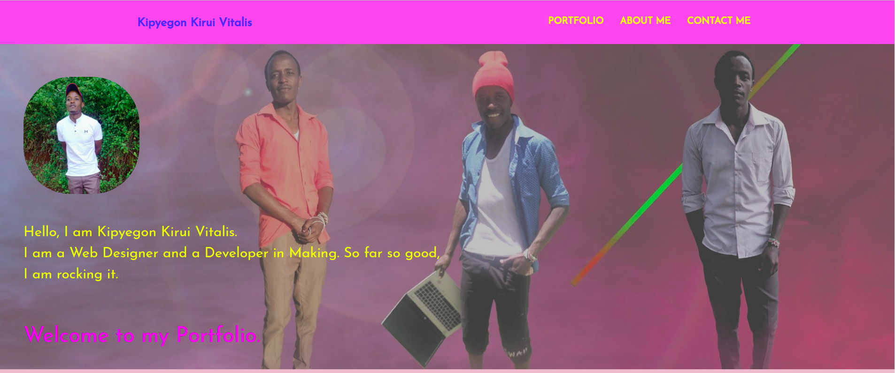
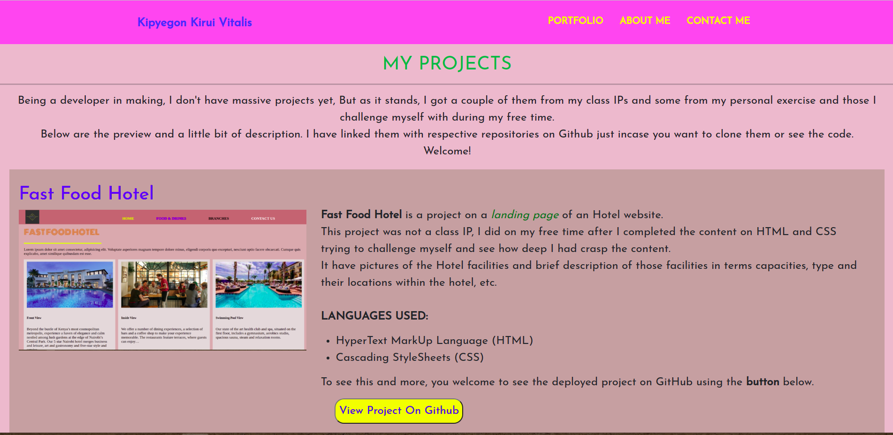
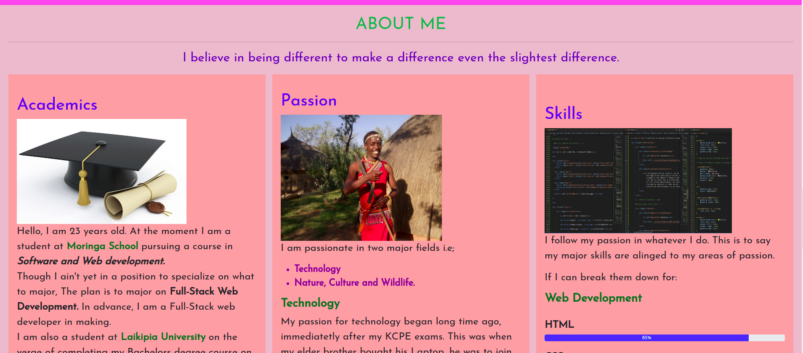
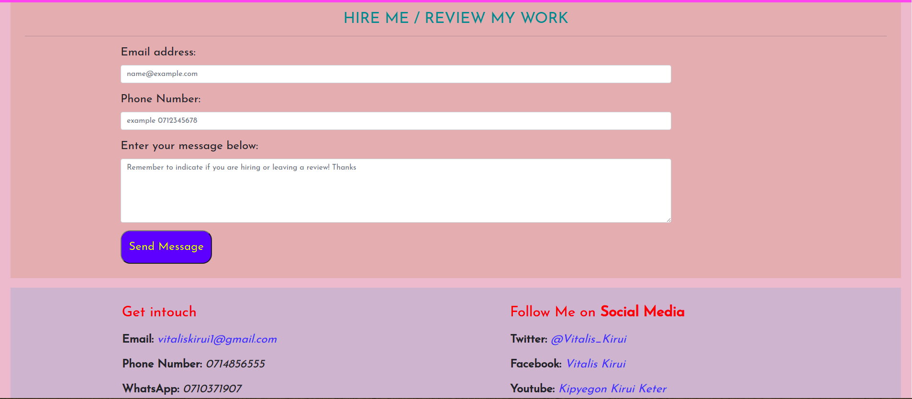

# My Portfolio Landing page.
This is my IP project on landing of my porfolio. It has various section including About me, my previous projects, a section where you can leave me a message and a footer for my contact details and my social media handles.
## Author
Kipyegon Kirui Vitalis.
# Description
When you are in the page, first you will a nav which at the moment doesnt'n lead you to any other page because its a single page. But when you are in My projects section, I placed some buttons which can lead you to where you can find the projects themselve on github.
Everything as is what you can read except for the part for contact me. This is where one enters his/her email, number and the message. On the message section, one has to indicate whether he/she is reaching out for hire or leaving a review.
Finally on the footer, It has my contact details like email, phone number and whatsapp number to the left. On the right are links to my social media platforms, incase someone wants to follow me.
# active link
This is the link to the deployed project https://vitalis-kirui.github.io/Prep-Portfolio-IP/
## screenshots of our website
Home Section.

&nbsp;

It has the navigation and a bit of introduction.

&nbsp;

Projects Section.

&nbsp;

In this section is a list of my previous projects.

&nbsp;

About Me Section.

&nbsp;

A section I gave information about myself in terms of Academics, Passion and Skills.

&nbsp;

Contact Me Section.

&nbsp;

This is the section where one can leave their messages.

&nbsp;

Footer Section.

&nbsp;

This is the section where my contact details and social media handles are.

## Setup/Installation Requirements
git-incase you want to clone it.
browser- to access git and deployment
internet
a pc
text Editor- once you have clone.
## known bugs
The page might not be responsive when its not full screen of a desktop and below
## Technologies used
* HTML
* CSS
* Javascript
* Bootstrap
## contact details
You can reach to me here for any assistance: Email:vitaliskirui1@gmail.com, Phone Number: 0714856555.